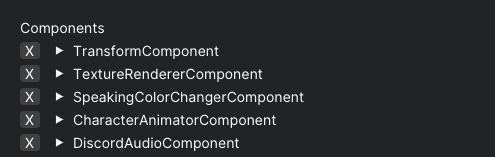
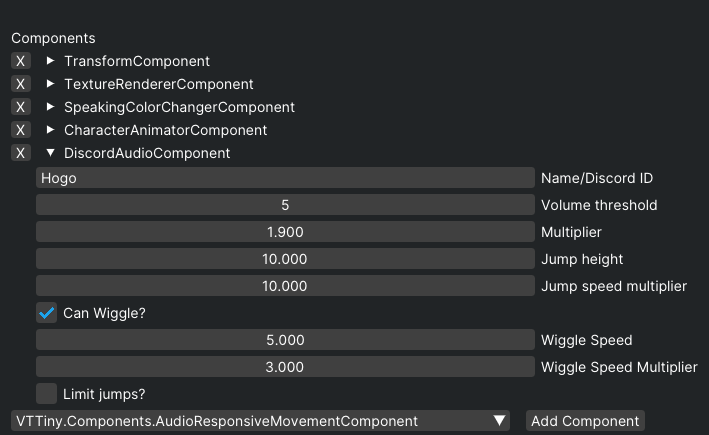
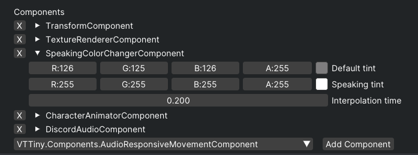
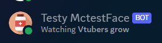

# VTubeTiny Discord bot

## What is this?

This is a small Discord bot that allows you to connect to a voice channel and be able to show them talking.

### Installation and setup

The first time you insert `DiscordAudioComponent` into your scene it will not do anything, you'll need to configure it. To do so, you need to create a Discord application and a bot account for it.

You'll have to go to the [Discord Developer Portal](https://discord.com/developers/docs/intro) following the guide over there, and then create a bot account for your application.
You'll have to invite the bot to your server, you do not need to give it any permissions, it will only need to connect to the voice channel.

Once you have your bot account, you'll need to get the token for it. You can do so by going to the "Bot" section of your application, and then clicking on "Copy"/"Reset Token" under the "Token" section (you can also give the bot a name and a profile picture, this will not be visible to other people anyway).

Once you have your token, you'll have to paste it under ``%appdata%\VTtinyDiscordBot\token.Json`` (or ``C:\Users\User\AppData\Roaming\VTtinyDiscordBot\token.json``) 
If you ran the component before it will have created the file for you, if not you'll have to create it yourself.

if you're on ``Linux``, the path will be ``~/.config/VTtinyDiscordBot/token.json``.

### Usage

> Once you have your bot account and token, you can add the ``DiscordAudioComponent`` to your scene, and then configure it.





> You can also set a Speaking color so the chacater will change color when speaking.



> You'll know that the bot is connected when in the discord server the bot is online and says "Watching Vtubers grow"



#### How to invite the bot to channel?

You can use the bot by typing ``/vc join``, the user who types the command will be the one who has to be connected to a voice channel.

if you want the bot to leave either disconnect it by hand or type ``/vc leave``.


### Debugging
Your ``token.json`` should look like this:
```json
{
  "token" : "OTUx0DA...Token goes here"
}
```